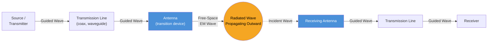

# Introduction to Antennas

Photo by <a href="https://unsplash.com/@artenico?utm_source=unsplash&utm_medium=referral&utm_content=creditCopyText">Gio L</a> on <a href="https://unsplash.com/photos/multiple-tv-antennas-and-satellite-dishes-on-a-weathered-rooftop-H9RkvByHP8U?utm_source=unsplash&utm_medium=referral&utm_content=creditCopyText">Unsplash</a>

---

If you are a 2000s kid like me, you definitely remember someone in your family climbing up to the terrace or roof of the house, rotating that scary-looking structure and asking one question miserably:

**"Working?? Aaya kya signal??"**

Every time the antenna was tilted, someone downstairs would stare at the old CRT television, waiting for the screen to become clear and for the speaker to finally start chiming again.

This little bit of engineering wizardry can be described as antenna alignment - adjusting the orientation of an antenna so that it can receive a stronger signal.

But this always fascinated young minds:

**"How is this thing just sitting there in the air, and somehow a signal from far away makes an image appear on the television?"**

Well well...

That question is about to be answered in detail. 
**Let's understand how antennas actually work.**

---

# 1.What Exactly is an Antenna ? 

`It is that part of a communication system (including Tx and Rx) that is designed to radiate or receive electromagnetic waves`

The IEEE Standard (145-1983) defines Antenna as "a means of radiating or receiving radio waves" . From this perspective , an antenna is a interface between a guided electromagnetic signal in transmission line and a radiated electromagnetic wave traveling through free space. 

--- 

