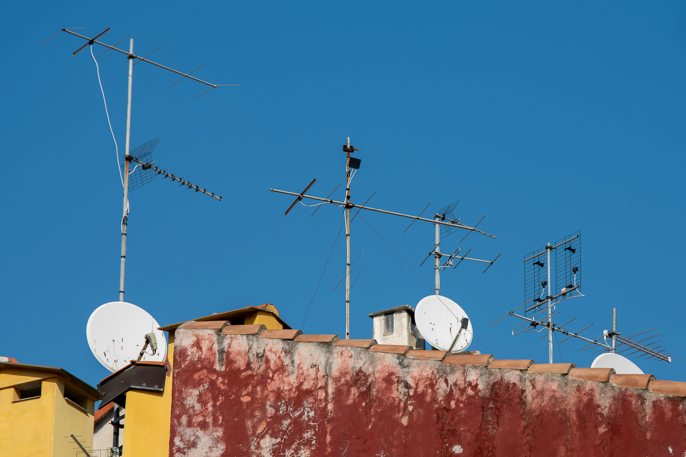
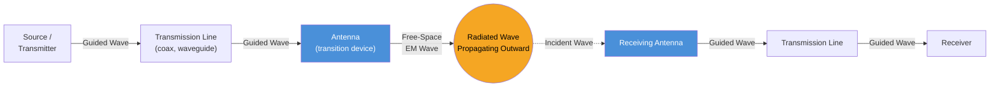
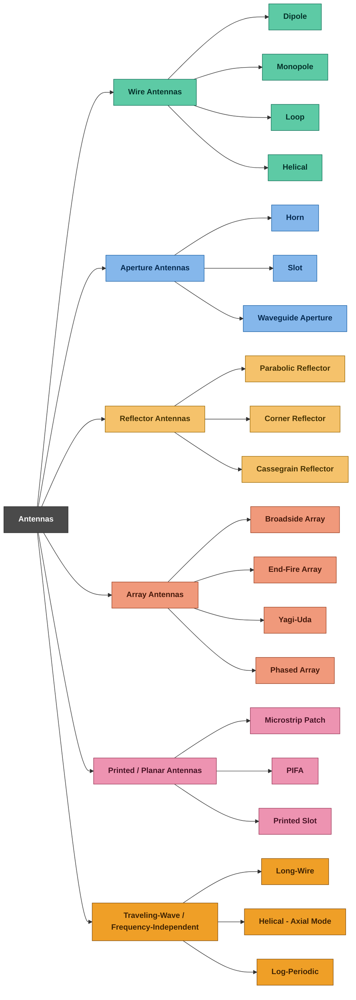

# Introduction to Antennas

Photo by <a href="https://unsplash.com/@artenico?utm_source=unsplash&utm_medium=referral&utm_content=creditCopyText">Gio L</a> on <a href="https://unsplash.com/photos/multiple-tv-antennas-and-satellite-dishes-on-a-weathered-rooftop-H9RkvByHP8U?utm_source=unsplash&utm_medium=referral&utm_content=creditCopyText">Unsplash</a>

---

If you are a 2000s kid like me, you definitely remember someone in your family climbing up to the terrace or roof of the house, rotating that scary-looking structure and asking one question miserably:

**"Working?? Aaya kya signal??"**

Every time the antenna was tilted, someone downstairs would stare at the old CRT television, waiting for the screen to become clear and for the speaker to finally start chiming again.

This little bit of engineering wizardry can be described as antenna alignment - adjusting the orientation of an antenna so that it can receive a stronger signal.

But this always fascinated young minds:

**"How is this thing just sitting there in the air, and somehow a signal from far away makes an image appear on the television?"**

Well well...

That question is about to be answered in detail. 
**Let's understand how antennas actually work.**

---

# 1. What Exactly is an Antenna ? 

`It is that part of a communication system (including Tx and Rx) that is designed to radiate or receive electromagnetic waves`

The IEEE Standard (145-1983) defines Antenna as "a means of radiating or receiving radio waves" . From this perspective , an antenna is a interface between a guided electromagnetic signal in transmission line and a radiated electromagnetic wave traveling through free space. 

> Insight : A transmission line is excellent at guiding electromagnetic energy from one point to another but it is not designed to efficiently launch that energy into free space . The antenna performs this transition. In transmission it converts the guided electromagnetic energy into a radiated electromagnetic wave during reception it performs the reverse process but with the wave incident on the antenna. 

## 1.1 Block Diagram 

--- 
# 1.2 Types of Antennas 

---
# 1.3 Why We Need an Antenna

An antenna is the device that bridges *guided* electrical signals (traveling through a wire or cable) and *free-space* electromagnetic waves (radio waves traveling through air/vacuum). It's needed because:

1. **Impedance/medium transition** - Electrical signals in a circuit travel as voltage/current along a conductor. To communicate wirelessly, this energy must be converted into an electromagnetic wave that can propagate through space, and then converted back into an electrical signal at the receiver. An antenna is this transducer - it works both ways (transmitting and receiving).

2. **Efficient radiation** - A random piece of wire carrying an AC signal does radiate a little energy, but very inefficiently. Antennas are specifically shaped and sized (typically related to the wavelength, like λ/2 or λ/4) so that the radiated power is maximized and directed usefully rather than lost as heat or reflected back into the source.

3. **No physical connection required** - Antennas remove the need for a continuous wired path between transmitter and receiver, enabling mobile communication, broadcasting to many receivers at once, satellite links, and communication where wiring is impossible (e.g., moving vehicles, aircraft, space probes).

4. **Directionality and gain control** - Antennas can be designed to focus energy in a particular direction (directional antennas) or spread it evenly (omnidirectional), letting engineers control coverage area, range, and signal strength as needed.

---

# 1.4 Practical Real-Life Limitations

1. **Size vs. frequency trade-off** - Antenna size is tied to wavelength. Low-frequency (long-wavelength) signals need very large antennas (e.g., AM radio towers can be 100+ meters tall), which is often impractical for portable/compact devices.

2. **Bandwidth limitations** - Most antennas are efficient only over a specific frequency range. Wideband operation typically requires more complex antenna designs, which increases cost and size.

3. **Environmental effects** - Obstacles (buildings, trees, terrain), weather (rain fade at high frequencies), and multipath reflections distort or weaken signals. This is why cell coverage drops indoors or in valleys.

4. **Radiation pattern imperfections** - Real antennas don't radiate perfectly according to theoretical patterns; nearby objects, ground effects, and mounting structures cause pattern distortion, nulls, and unwanted side lobes.

5. **Efficiency losses** - Impedance mismatch between the antenna and transmission line/circuit causes reflected power (measured via VSWR), reducing effective radiated power. Ohmic losses in the antenna material also waste energy as heat.

6. **Polarization mismatch** - If the transmit and receive antennas aren't aligned in polarization (vertical vs horizontal, linear vs circular), significant signal loss occurs.

7. **Interference and regulatory constraints** - Antennas can pick up or cause interference with other systems, and spectrum allocation rules constrain which frequencies/power levels can be used.

8. **Physical/mechanical constraints** - Wind loading, weight, weatherproofing, and installation cost limit antenna size and placement, especially for large directional or array antennas (e.g., satellite dishes, cellular towers).

9. **Near-field vs far-field behavior** - Antenna performance (gain, pattern) is only well-defined in the far field; near sources, behavior is more complex, which matters in compact device design (e.g., smartphones where the antenna is close to other components).

---

# 1.5 Applications

- **Broadcasting**: AM/FM radio, television transmission
- **Mobile & wireless communication**: Cell phones, Wi-Fi routers, Bluetooth devices
- **Satellite communication**: TV broadcast (DTH), GPS, weather satellites
- **Radar systems**: Air traffic control, weather radar, military surveillance, automotive collision-avoidance radar
- **Point-to-point microwave links**: Backhaul for telecom towers
- **RFID and NFC**: Contactless payments, inventory tracking, access cards
- **IoT devices**: Smart home sensors, wearables
- **Astronomy and space communication**: Radio telescopes, deep-space probes (e.g., Voyager's high-gain dish antenna)
- **Medical applications**: MRI RF coils, wireless capsule endoscopy transmitters
- **Military/defense**: Electronic warfare, secure communication, stealth-related antenna design

